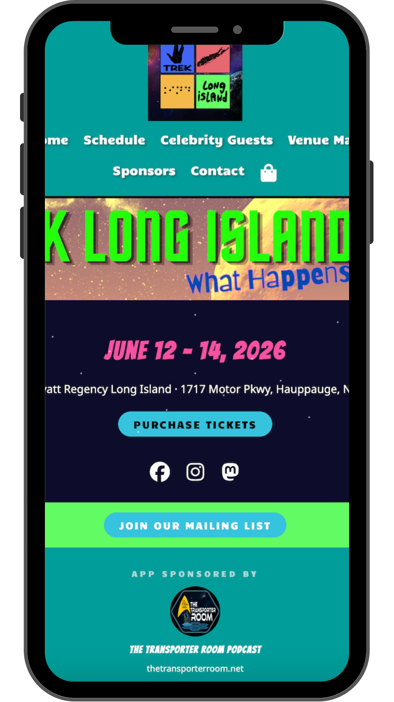
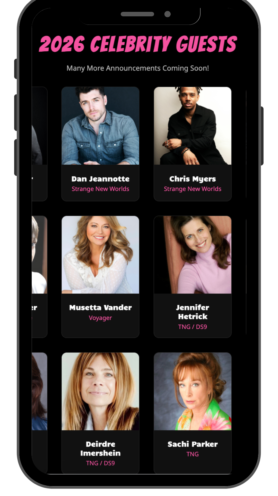
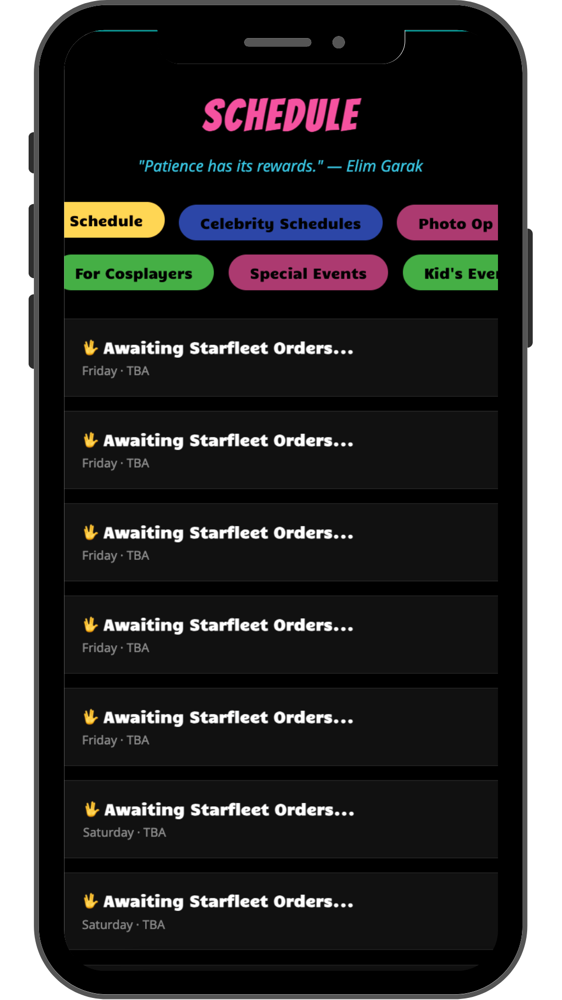
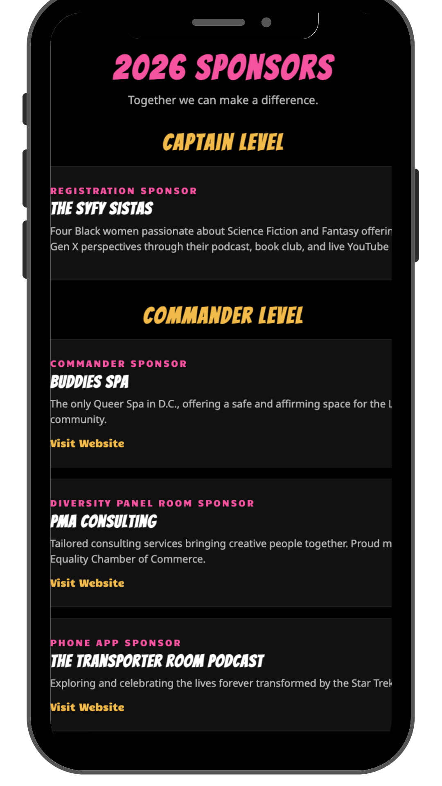
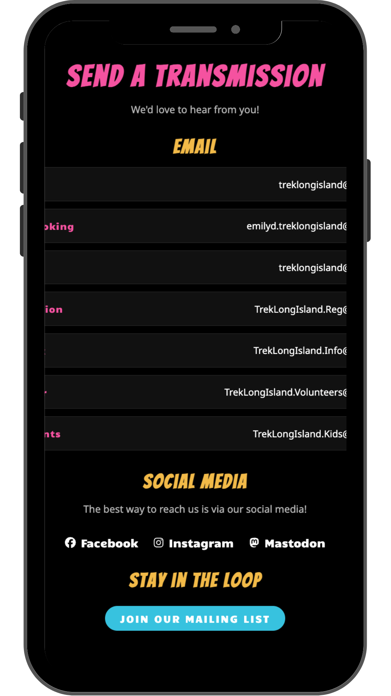

# 🖖 Trek Long Island Convention App

> ⚠️ **Work in Progress!** This app is actively being developed and will be available for download on the **App Store** and **Google Play** beginning of 2026.


## 📌 Project Description & Purpose

This is my **first commissioned, real-world project**, built for an actual client and convention attendees.

**Trek Long Island** is Long Island's Star Trek convention, running June 12-14, 2026 at the Hyatt Regency Long Island. As a member of the [Trek LI crew](https://treklongisland.com/our-crew/), I was brought on to design and develop an official companion app for the event.

The app serves as a one-stop resource for attendees, featuring the full convention schedule, celebrity guest profiles, venue information, sponsor listings, and more. Currently built as a **React web app**, it is planned for conversion to **React Native** for native iOS and Android distribution.

---

## 🚀 Live Site

🌐 [trek-li-app.vercel.app](https://trek-li-app.vercel.app/)

---

## 📱 App Screenshots

<div align="center">

| Home                                                        | Guests                                                        | Schedule                                                        | Sponsors                                                        | Contact                                                        |
| ----------------------------------------------------------- | ------------------------------------------------------------- | --------------------------------------------------------------- | --------------------------------------------------------------- | -------------------------------------------------------------- |
|  |  |  |  |  |

</div>

---

## ✨ Features

- 🗓️ **Interactive Schedule** - Tabbed navigation across 6 schedule categories (Main, Celebrity, Photo Ops, Cosplay, Special Events, and Kids Events)
- 🌟 **Celebrity Guests** - Full guest grid with headshots, Star Trek series info, and IMDB links
- 🏳️‍🌈 **IDIC Track** - Dedicated section for diversity panel guests and panelists
- 🎟️ **Ticket Button** - Direct link to purchase convention passes
- 🏨 **Venue Map** - Interactive map and details for the Hyatt Regency Long Island
- 💼 **Sponsors Page** - Full sponsor listings by level (Captain, Commander, Lieutenant) plus fan sponsors and charitable organizations supported by Trek LI
- 📬 **Contact Page** - All Trek LI department emails and social media links
- 🛍️ **Official Swag** - Shopping bag icon linking directly to the Trek LI Etsy store
- 📱 **Mobile Responsive** - Optimized for phone use since most attendees will use the app on the go
- ♿ **WCAG Accessibility** - Semantic HTML, ARIA labels, skip links, and focus-visible styles implemented using the axe Accessibility Linter

---

## 🛠️ Tech Stack

**Frontend**

|            |                             |
| ---------- | --------------------------- |
| Languages  | HTML, CSS, JavaScript       |
| Framework  | React + Vite + React Router |
| Libraries  | React Icons                 |
| Deployment | Vercel                      |

**Planned - Backend (Phase 2)**

|            |                      |
| ---------- | -------------------- |
| Languages  | JavaScript           |
| Framework  | Express.js (Node.js) |
| Database   | PostgreSQL           |
| Deployment | Render               |

**Planned - Mobile (Phase 3)**

|              |                               |
| ------------ | ----------------------------- |
| Framework    | React Native / Expo           |
| Distribution | Apple App Store & Google Play |

---

## 💻 Getting Started

```bash
# Clone the repo
git clone https://github.com/Babz-G/trek-li-app.git

# Navigate into the project
cd trek-li-app

# Install dependencies
npm install

# Start the dev server
npm run dev
```

Then open [http://localhost:5173](http://localhost:5173) in your browser.

---

## 🔹 API Documentation

🚧 **Coming in Phase 2!** The backend API will include endpoints for managing guests, schedule, sponsors, and more.

| Method   | Endpoint                 | Description                       |
| -------- | ------------------------ | --------------------------------- |
| `GET`    | `/celebrities`           | Retrieve all celebrity guests     |
| `GET`    | `/schedule`              | Retrieve full convention schedule |
| `GET`    | `/sponsors`              | Retrieve all sponsors             |
| `GET`    | `/charities`             | Retrieve all supported charities  |
| `POST`   | `/admin/celebrities`     | Add a new celebrity guest         |
| `PUT`    | `/admin/celebrities/:id` | Update a celebrity guest          |
| `DELETE` | `/admin/celebrities/:id` | Remove a celebrity guest          |
| `POST`   | `/admin/schedule`        | Add a schedule event              |
| `PUT`    | `/admin/schedule/:id`    | Update a schedule event           |
| `DELETE` | `/admin/schedule/:id`    | Remove a schedule event           |

---

## 🗄️ Database Schema

🚧 **Coming in Phase 2!** Planned tables include:

```sql
-- Celebrity Guests
CREATE TABLE celebrities (
  id SERIAL PRIMARY KEY,
  name VARCHAR(255),
  series VARCHAR(255),
  img_url VARCHAR(500),
  imdb_url VARCHAR(500)
);

-- Schedule Events
CREATE TABLE schedule (
  id SERIAL PRIMARY KEY,
  title VARCHAR(255),
  time VARCHAR(50),
  location VARCHAR(255),
  day VARCHAR(50),
  category VARCHAR(50)
);

-- Sponsors
CREATE TABLE sponsors (
  id SERIAL PRIMARY KEY,
  name VARCHAR(255),
  level VARCHAR(50),
  description TEXT,
  img_url VARCHAR(500),
  website_url VARCHAR(500)
);

-- Charities
CREATE TABLE charities (
  id SERIAL PRIMARY KEY,
  name VARCHAR(255),
  description TEXT,
  img_url VARCHAR(500),
  website_url VARCHAR(500)
);

-- Admin Users
CREATE TABLE users (
  id SERIAL PRIMARY KEY,
  username VARCHAR(255),
  password_hash VARCHAR(500),
  created_at TIMESTAMP DEFAULT NOW()
);
```

---

## 👩‍💻 Developer

**Barbara Gaynor**  
🎨 Graphic Designer | Web Developer | Aspiring UX/UI Designer

[](https://github.com/Babz-G)
[](https://www.linkedin.com/in/babzgaynor)

---

## 🔗 Links

- 🌐 [Trek Long Island Official Website](https://treklongisland.com)
- 🎟️ [Purchase Tickets](http://treklongislandtickets.square.site/)
- 📸 [Trek LI on Instagram](https://www.instagram.com/treklongisland/)
- 📘 [Trek LI on Facebook](https://www.facebook.com/TrekLongIsland)
- 🐘 [Trek LI on Mastodon](https://mastodon.world/@TrekLongIsland)
- 🛍️ [Official Trek LI Merch on Etsy](https://www.etsy.com/shop/TrekLongIsland)
